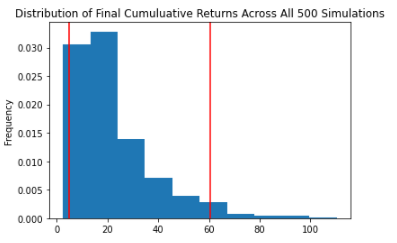

# Challenge5

# Financial Planning with APIs and Simulations

This python command-line interface application is designed by a fintech consulting firm to help credit union members evaluate their financial health. The application works by accessing current closing prices of cryptocurrencies BTC and ETH, stock SPY, and bond AGG through making API calls. The platform then evaluates the stock and bond holdings, and the emergency fund by using the Alpaca SDK. It also creates a financial planner for retirement with the help of Monte Carlo Simulation. It forecasts cumulative returns in 10 Years and makes a recommendation on a fund that works best with client's investment objectives.

---

## Technologies

This project leverages Python 3.7 with the following packages and dependencies:

* [pandas](https://pandas.pydata.org/) - An open-source data analysis and manipulation tool.

* [os](https://docs.python.org/3/library/os.html) - For accessing the API key from the environment file

* [dotenv](https://pypi.org/project/python-dotenv/) - To use the env functionality for accessing the API key from the environment file

* [json](https://docs.python.org/3/library/json.html) - For working with the response data

* [requests](https://docs.python-requests.org/en/master/) - For making the API call to Quandl

* [MCForecastTools](https://github.com/jonowens/financial_planning) - A useful tool for predicting future results by calculating a formula multiple times with different random inputs

* [%matplotlib inline](https://stackoverflow.com/questions/43027980/purpose-of-matplotlib-inline) - Tells Jupyter to create the plot inline with the code in the notebook

* [alpaca_trade_api](https://alpaca.markets/docs/) - A python library for the Alpaca Commission Free Trading API
---

## Installation Guide

Python 3.7, GitBash, and JupyterLab are required to be installed before running the application.

---

## Usage

To use the Financial Planning with APIs and Simulations application simply clone the repository and run the **financial_planning_tools.ipynb** with:

```python
python financial_planning_tools.ipynb
```

Attached screenshots below show the different plots

  





---

## Contributors

Brought to you by Trilogy and Christine Guo (www.linkedin.com/in/christine-guo)

---

## License

NoNe